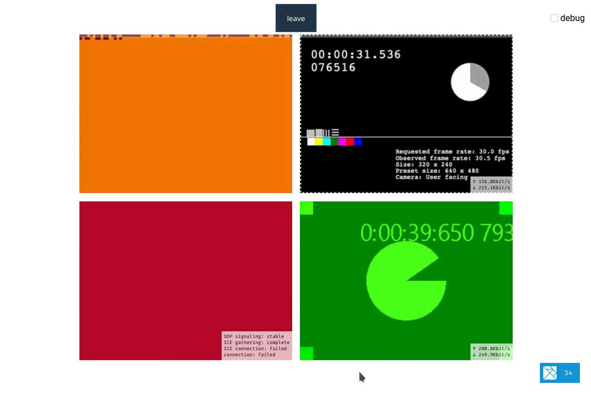

# ELM-CONF

This is a simple WebRTC conferencing example that uses custom elements (aka "webcomponents") to render the media streams received from other peers.



I also wrote [a post with more information and a detailed explanation](https://marc-walter.info/posts/2020-06-30_elm-conf/) of key concepts.


## Installation
Install [node.js](https://nodejs.org) and then the local dependencies, e.g. via `npm install`.


## Usage
For local development:
I use [caddy](https://caddyserver.com) as proxy, but it works just as well when starting the [elm-app dev server](https://github.com/halfzebra/create-elm-app#quickstart) and the backend server directly.

**INFO:** You can enable or disable the elm debugger in the `.env` file.


### Directly
Start the server
```sh
npm start
# or
node server.js
```

Then configure the backend server address in `.env`, e.g.:
```
ELM_APP_WS_SERVER=http://localhost:8443
```

And then start the live-reload elm-app dev server
```sh
npx elm-app start
```

### With caddy
```sh
# Start the backend server
node server.js

# Compile the app
npx elm-app build

# Start caddy
caddy start --config Caddyfile
```
